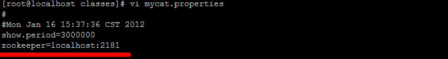

## 安装Zookeeper

A. 上传安装包 
	zookeeper-3.4.6.tar.gz
	
B. 解压
	tar -zxvf zookeeper-3.4.6.tar.gz -C /usr/local/

​	

C. 创建数据存放目录
	cd /usr/local/zookeeper-3.4.6/
	mkdir data

​	

D. 修改配置文件名称并配置

​	cd config

​	mv zoo_sample.cfg zoo.cfg

​	

E. 配置数据存放目录
	dataDir=/usr/local/zookeeper-3.4.6/data
	
F. 启动Zookeeper
	bin/zkServer.sh start

​	bin/zkServer.sh status

## 安装Mycat-web

A. 上传安装包 
	Mycat-web.tar.gz
	
B. 解压
	tar -zxvf Mycat-web.tar.gz -C /usr/local/

​	

C. 目录介绍
    etc         ----> jetty配置文件
    lib         ----> 依赖jar包
    mycat-web   ----> mycat-web项目
    readme.txt
    start.jar   ----> 启动jar
    start.sh    ----> linux启动脚本

​	

D. 启动
	sh start.sh
	
E. 访问
	http://192.168.200.210:8082/mycat

​	

> 备注: 
>
> ​	如果Zookeeper与Mycat-web不在同一台服务器上 , 需要设置Zookeeper的地址 ; 在/usr/local/mycat-web/mycat-web/WEB-INF/classes/mycat.properties文件中配置 : 
>
> ​	 

